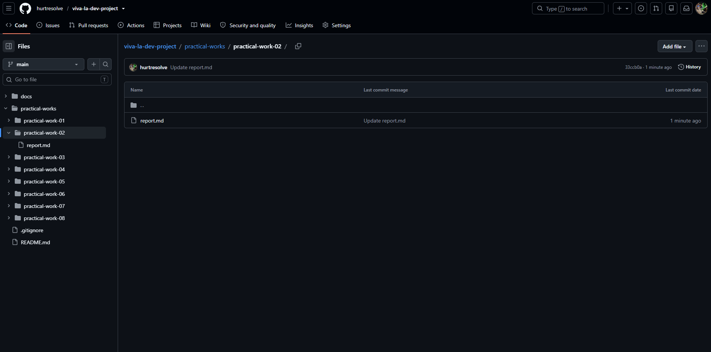
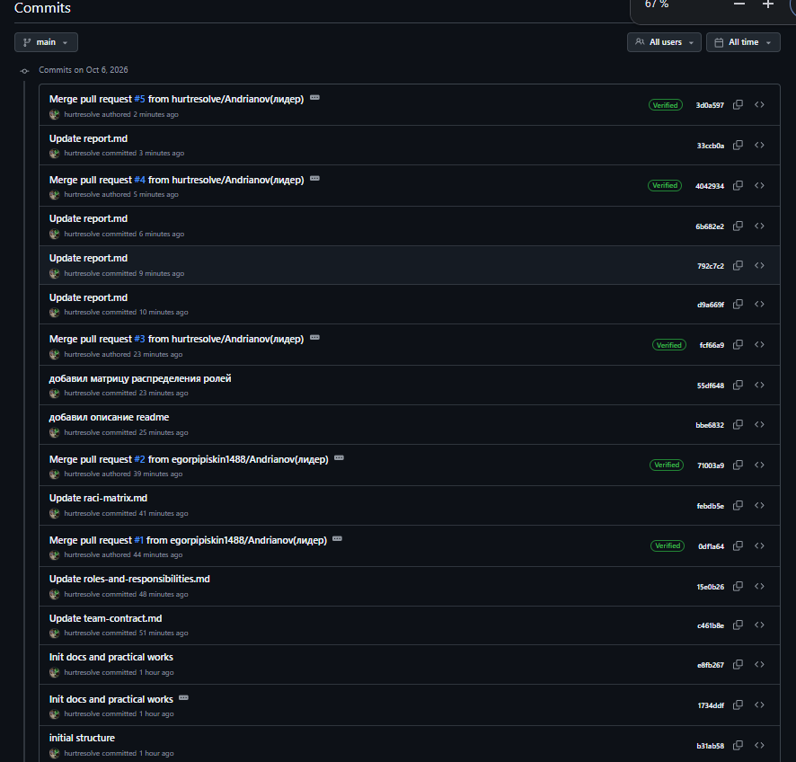

# Практическая работа №2
Практическая (самостоятельная) работа № 2
Организация работы с репозиторием проекта и распределение ответственности в Git

Команда: viva la dev

Дисциплина: «Введение в профессиональную деятельность»
2026

1. Регистрация участников на GitHub
Все участники команды самостоятельно создали учётные записи на GitHub.

№	Участник	Роль (из СР1)	Логин на GitHub
1	Андрианов Егор	Лидер команды	hurtresolve

2	Новиков Богдан	Исследователь	n0WMEEE

3	Максимов Егор	Программист	hatredk1dev

4	Маркелов Георгий	Специалист по тестированию	Goga2939

5	Лавренова Александра	Специалист по данным	lavriksaa

6	Панферова Анастасия	Архитектор	pvnfvv
2. Командный репозиторий
Репозиторий создан лидером команды (Андриановым Егором) на платформе GitHub.

Ссылка на репозиторий: https://github.com/hurtresolve/viva-la-dev-project

3. Структура репозитория
Репозиторий организован строго по структуре, заданной в методических указаниях.

Назначение разделов:
README.md — общая информация о проекте, состав команды, ссылки на основные документы.

docs/team-contract.md — правила взаимодействия в команде (Telegram-чат, порядок обсуждения задач, принятия решений и соблюдения сроков); перенесено из СР1.

docs/roles-and-responsibilities.md — распределение ролей с обоснованием, профессиональные стандарты и трудовые функции; перенесено из СР1.

docs/raci-matrix.md — матрица RACI из СР1.

practical-works/ — отдельная папка для каждой практической работы: 

report.md (отчёт), assets/ (рисунки, скриншоты), src/ (материалы и исходный код, если есть).

scripts/ — вспомогательные скрипты.

.gitignore — файлы и каталоги, которые не попадают в репозиторий (служебные файлы среды разработки, временные файлы, файлы с секретами).

4. Распределение обязанностей по работе с репозиторием
Обязанности по работе с репозиторием распределены на основе матрицы RACI и ролей, определённых в СР1. Лидер команды (Андрианов Е.) является ответственным (A) за все направления работы с репозиторием, так как по СР1 он отвечает за координацию работы и подготовку отчётов.

4.1. Общее распределение (R/A)
 Создание и настройка репозитория:
   Исполнитель (R): Андрианов Е. (лидер), Панферова А. (архитектор)
   Ответственный (A): Андрианов Е.

 Поддержание структуры папок и файлов:
   Исполнитель (R): Все участники — каждый для своих разделов
   Ответственный (A): Андрианов Е.

 Написание отчётов по практическим работам:
   Исполнитель (R): Все участники согласно своим ролям
   Ответственный (A): Андрианов Е.

 Внесение коммитов с осмысленными сообщениями:
   Исполнитель (R): Каждый участник — за свои изменения
   Ответственный (A): Андрианов Е.

 Проверка Pull Request:
   Исполнитель (R): Андрианов Е., Панферова А.
   Ответственный (A): Андрианов Е.

 Слияние веток (merge):
   Исполнитель (R): Андрианов Е.
   Ответственный (A): Андрианов Е.

 Резервное копирование и поддержание актуальности:
   Исполнитель (R): Все участники
   Ответственный (A): Андрианов Е.

4.2. Обязанности по роля
Андрианов Егор — лидер команды.
Создаёт командный репозиторий, настраивает доступ участников и защиту основной ветки main. Координирует работу: ставит задачи, следит за сроками и соблюдением договорённостей. Проверяет Pull Request и выполняет слияние веток в main. Отвечает за актуальность README.md, docs/team-contract.md, docs/raci-matrix.md и итоговую подготовку отчётов. Это соответствует трудовым функциям руководителя разработки по организации работы и контролю результата, а также его роли A в матрице RACI по формированию команды, организации коммуникации и подготовке отчёта.
Панферова Анастасия — архитектор.
Участвует в первоначальной настройке репозитория и отвечает за целостность его структуры: контролирует, чтобы папки и файлы соответствовали заданной схеме. Проверяет Pull Request с точки зрения структуры и логики организации материалов (в дальнейшем — архитектуры решения). Отвечает за разделы, связанные со структурой и схемами системы (интерфейс, навигация, схемы в assets/).
Максимов Егор — программист.
Отвечает за содержимое src/ и материалы прототипа в практических работах 6 и 7, а также за вспомогательные скрипты в scripts/ и файл .gitignore. Ведёт разработку в отдельных ветках, оформляет код и коммиты по установленным требованиям, исправляет замечания, выявленные при проверке.
Маркелов Георгий — специалист по тестированию.
Проверяет корректность оформления отчётов и работоспособность материалов (ссылок, прототипа, файлов) перед слиянием. Участвует в ревью Pull Request, фиксирует найденные замечания в комментариях к ним. В СР7 отвечает за материалы проверки прототипа и таблицу замечаний.
Лавренова Александра — специалист по данным.
Отвечает за разделы, связанные с анализом и обработкой информации: сбор и структурирование материалов по целевой аудитории (СР3) и итоговому перечню требований (СР4), таблицы и данные в assets/. Следит, чтобы в репозиторий не попадали лишние и конфиденциальные файлы.
Новиков Богдан — исследователь.
Отвечает за исследовательскую часть отчётов: описание предметной области, анализ аналогов, обоснование выбора темы проекта и формулирование выводов. Оформляет эти материалы в отчётах практических работ.

4.3. Правила работы с ветками
Прямые коммиты в main не допускаются; изменения вносятся только через отдельные ветки и Pull Request.
Имя ветки: role/<название_роли> (например, role/programmer, role/architect, role/tester) или feature/<имя_участника>.
Сообщения коммитов описывают суть изменения, например: feat: добавил описание трудовых функций для роли программиста.
Слияние выполняется после ревью другим участником команды; итоговое слияние в main выполняет лидер.

5. Практическая работа с Git
Каждый участник выполнил следующие действия:
Клонировал репозиторий на локальный компьютер (git clone).
Создал свою ветку (git checkout -b role/<название_роли>).
Внёс изменения в соответствующие файлы (дополнил документ или отчёт по своей роли).
Сделал коммит с осмысленным сообщением.
Отправил изменения в удалённый репозиторий (git push origin <ветка>).
Создал Pull Request для слияния своей ветки с main.
Получил ревью от другого участника команды; слияние выполнено после одобрения.

5.1. История коммитов
Историю коммитов с указанием авторов можно просмотреть командой git log --oneline --graph или на странице Commits репозитория. Из неё видно, кто и когда вносил изменения, то есть фиксируется вклад каждого участника.

5.2. Pull Request и ревью
Для каждой ветки создан Pull Request; в комментариях к ним проведено ревью другим участником команды.
Скриншоты Pull Request и процесса ревью:

6. Вывод
Система контроля версий Git вместе с GitHub позволила организовать совместную работу команды в едином рабочем пространстве. Единая структура репозитория упрощает поиск материалов и их проверку. Работа через отдельные ветки и Pull Request позволяет вносить изменения параллельно, не мешая друг другу, а ревью помогает вовремя находить ошибки. История коммитов фиксирует, кто и что изменил, поэтому вклад каждого участника виден и проверяем. Закрепление обязанностей по ролям из СР1 и матрице RACI делает ответственность за разные части репозитория прозрачной: за результат отвечает лидер, исполнители отвечают за свои разделы.